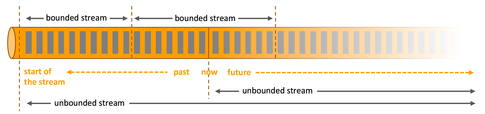
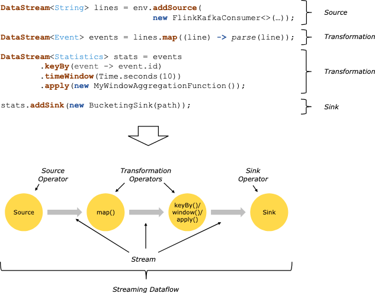

### batch_vs_stream

* stream
    1. 这个世界的信息随着时间不断出现
    2. 举例来说
        * 支付宝的交易接口每一秒都在被调用，源源不断产生交易信息
        * 物联网的传感器也在不断感受现实世界，并产生一个个信号，传输给"中心"
    3. 这些信息很自然地可以被我们看成像水流一样，如上图，我们先给他们一个名字: STREAM （流）
    4. 在这个图上加上"现在"、"过去"和"将来"这几个词以后，我们可以提炼出另一些信息
        * stream 可能是无穷无尽的，因为"将来"无穷无尽，这里再给一个名词： unbounded stream （无限流）
        * "过去"的流如果被我们保存下来，并加以回放，我们能够得到一个有限流: bounded stream （有限流）
        * 值得指出的是，bounded stream 其实是 unbounded stream 的一部分，即使他跨越了"现在"，甚至全部存在于"未来"
* batch
    1. batch 在 flink 内的定义是 一种特殊的 stream （如果不考虑实现，可以推广）
    2. 切记: batch 不等于 bounded stream
    3. bounded 只是 batch 的必要条件
    4. batch 的关键在于: 在浏览完所有数据之前，系统没必要给出任何结果信息
* transform 与 operator

    
    1. flink 处理数据的过程可以粗略划分为： 定义 source（flink 的输入）、定义 sink（flink 的输出） 和 定义 transform（逻辑处理过程）
    2. source 和 sink 在 [word_count 章节](word_count.md) 已经涉及了一点，更多的细节将在后面的章节继续介绍
    3. transform （数据处理过程）是将一种类型的数据集（图中是DataStream）转换为另一种（图中也是DataStream)
    4. 如果把数据集(DataStream) 看成是边，处理逻辑就可以看成节点，这个节点我们就称为 Operator，它承载了数据处理逻辑
* event
    1. DataStream 里面包含的信息是 Records，对应流的概念，在逻辑上，我们可以称为 events
* state
    1. 在events 流过 operator 的时候，operator 将实时向下游吐出events （处理结果）
    2. 必须认识到，有些处理逻辑不仅仅要求operator 具有计算的能力，还需要有记忆的能力，即，多个 event 决定向下游吐出的一个 event
    3. 比如
        * operator="求对数" 时，任意一个给定一个"数值"，都能产生一个"对数"
        * operator="求总和" 时，每给定一个数值，都需要额外知道"在这个数值之前的总和"才能向下游吐出"当前的总和"
        * 更特殊的，operator="5分钟内的平均值"，需要额外知道"5分钟内所有数值的总和"
            + 这里可以引出 process time/event time 和 window 的概念，后续章节再介绍
    4. 多个 input event 决定 一个 output event 的逻辑，要求每一个 operator 具有记忆的能力，operator 拥有的"记忆"就是所说的 state
    5. 在强调 operator 具有 state 的时候，不应该忽视更常见的 "没有 state 的 operator"
    6. 天然的，如果对 state 进行了持久化，flink 就有了容错（Fault Tolerance）的可能
    7. 不应该忽视: state 具有 distributed 和 local 的特点
        * 上图中展示的 "节点" 和 "边" 是逻辑上的概念，通常 flink 会将其"并发化"以处理大规模数据（这个过程后文再解释）
        * 因此，state 也必须随之并发化
        * 即使 operator 并发化后，每一个operator 也只需要知道自己 state，不需要知晓其他并发实例的 state
        * 在这里提及 distributed 和 local 两个特点是因为他们是 flink 高并发、高吞吐和低延时的支撑之一
