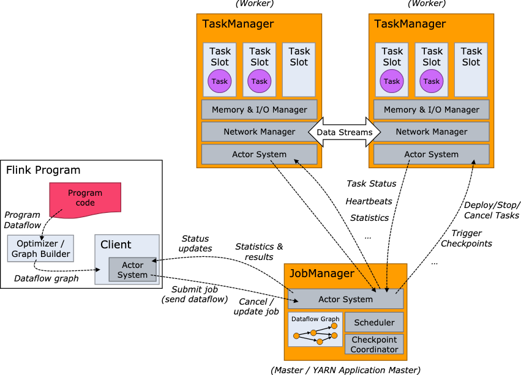
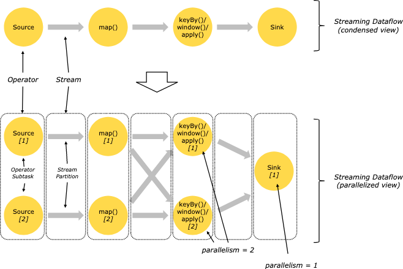
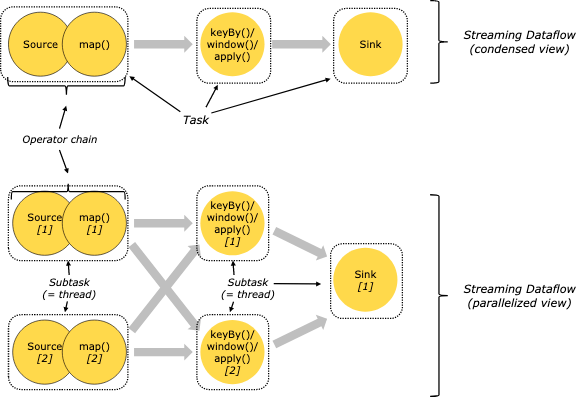
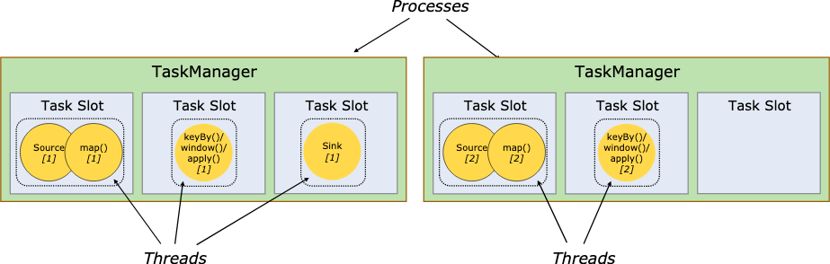
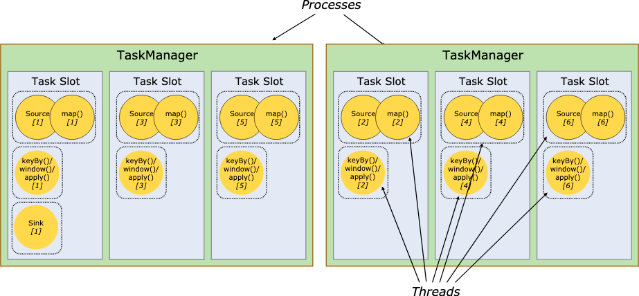

1. Client vs Cluster
    1. 上图可以分成两块 左侧的 Client 和 右侧的 Cluster 两个部分
    2. Client 负责提交 作业 Job （一个 Flink Program）
    3. 代码翻译成 Dataflow Graph 是在 Client 端完成的（代码编译在 Client）
    4. Dataflow Graph 的优化也是在 Client 端完成的
2. JobManager 与 TaskManager
    1. 都是组成 Flink Cluster 的基本节点
    2. JobManager 是集群的"Master"，负责
        * 接收 Client 提交 的 Job
        * 与 Client 交互 统计信息和结果
        * 接收 对 Job 的操作，例如 Cancel 、 Resume 和 Stop
    2. 可以通过不断向 JobManager 注册 TaskManager 来对集群进行横向扩展
    3. JobManager 其实也可以多实例，用于保障高可用性
    4. JobManager 负责 Job 的调度、Checkpoint 机制的维护等
    5. TaskManager 是集群的"Worker"，实际上是为集群提供 Operator 执行的容器 Task Slot
    6. Stream 的数据交换是 TaskManager 之间的直接通讯
3. JobManager 承担的角色
    1. ResourceManager: 承担
    2. Dispatcher
    3. JobMaster
4. 不同的角度看 Dataflow Graph
    * Parallel Dataflow

   
    * Parallel Dataflow with Operator Chains

   
    * Operator Chains running in Slots

   
    * Operator Chains share Slots with Threads

   
5. flink 的执行模式
    * Session Cluster
    * Job Cluster
    * Application Cluster