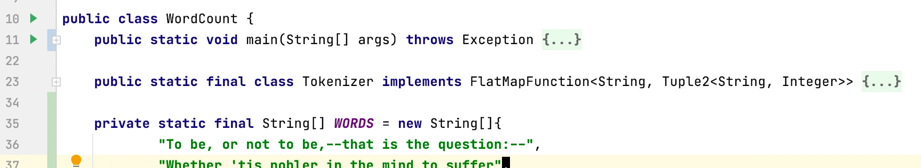
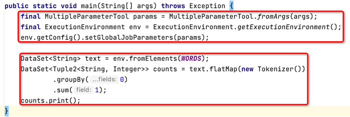
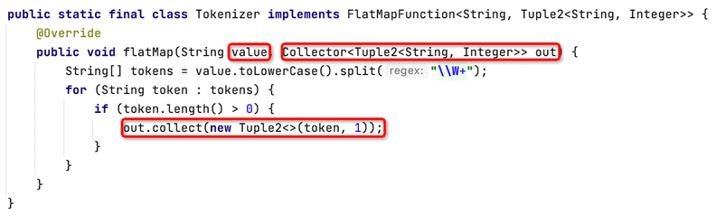
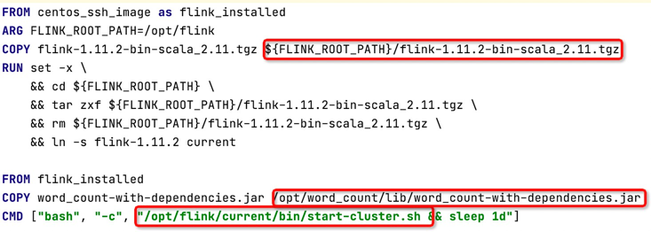

### word_count

1. 我们即将做什么
    * 分布式系统的hello world 级别程序： word_count 统计单词数量
    * 普遍的场景是
        + 一个分布式存储上有大量的文本文件
        + 每一个文本文件都包含大量的单词（英文单词）
        + 输入: 将这些文件作为输入
        + 输出: 统计出每一个单词的数量
        + 处理: 如何提取出单词是关键逻辑
    * 简化成hello world 级别，便于起步理解
        + 文本文件只有一个，本例甚至将文本写入代码中，连文件的概念都先去掉
        + 输出结果直接打印到标准输出
        + 所有的单词以空白符分割
2. 代码与文档
    * 提供完整的代码: [word_count/](../word_count)
    * 尽量剥离与flink 无关的细节，如 gradle、k8s 等
    * 尽量关注与flink 起步内容（减少细节，细节会在后续介绍）
3. 关键知识点
    * word count 代码解析及对flink 应用程序基本模块的理解
    * 如何在IDE 中直接执行flink 程序
    * 如何启动一个伪分布式的flink 集群（一个docker 节点）
    * 如何将一个flink 程序提交到集群
    * 扩展: 如何从源码开始构建flink 包（足够的好奇心，就免不了要探索一下改改源码）
4. word count 代码解析
    * 关键代码: [WordCount.java](../word_count/src/main/java/flink/learning/example/wordcount/WordCount.java)
    * 整体结构
      
        + main 方法程序入口和流程代码等
        + Tokenizer 类用于从文本中提取单词
        + WORDS 变量 承载了输入文本数据
    * main 方法
      
        + 红框将整个main 方法分为两部分: 环境构建 和 逻辑处理
        + 环境构建部分
            1. 第一句将程序的输入参数转换成 MultipleParameterTool 类型；
            2. 第二句（关键）创建了一个执行环境
            3. 第三句将参数设置到执行环境中（本例无参，保留只是为了完整性）
        + 逻辑处理部分
            1. 概念: 一个flink 应用可以大致看成 source + sink + 处理流程
            2. 第一句将保存了文本信息的 WORDS 转换成 source （DataSet 类型, 数组的每一个元素模拟文件的一行内容)
            3. 第三句其实定义了一个最简单的 sink （直接将结果输出到标准输出）
            4. 第二句进行了三个操作
                * 迭代输入数据，每一行文本都交给 Tokenizer 处理，将 Tokenizer 的输出展开 (word, count)
                * 按照第0个字段（即, word, 单词本身）进行 group by 操作
                * 对 group by 以后的每个组，按照第1个字段(即, count, 单词出现的次数) 进行 sum 操作
            5. 这一部分用短短三条语句描述了输入、输出和处理流程，实现了单词的词频统计
    * Tokenizer 类
      
        + 从 main 方法的解读中，我们可以看到 Tokenizer 实际上只负责提取单词
        + Tokenizer 在逻辑上的输入为一行文本，在逻辑上的输出为 (word, count) 单词的词频信息
        + 首先，Tokenizer 在main 方法中，作为 flatmap 的输入，因此需要继承一个 FlatMapFunction 的接口，泛型内定义了输入和输出的类型
        + 其次，flatMap 方法的定义中，value 就是输入的一行文本，Collector 类型的 out 是 link 传给该方法使用的一个工具（用于向下游输出）
        + 最后，其他逻辑其实比较简单，转小写、正则表达式切割、长度判定以及将词频信息(word, count) 输出
5. 如何在IDE 中直接执行flink 程序
    * 简单粗暴，直接执行main 方法
    * flink 会使用模拟 environment 执行
    * [word_count 的 build.gradle](../word_count/build.gradle) 定义了 runLocalWordCount task 可以直接运行
    * ./gradlew --quiet :word_count:runLocalWordCount
6. 如何启动一个伪分布式的 flink 集群（一个docker 节点）
    * docker 镜像打包请参考 [single.cluster.dockerfile](../word_count/docker/single.cluster.dockerfile)
      
        + 关键是将 flink 包和应用 jar 包都拷贝进去，并使用 CMD 启动cluster 即可
        + web ui 的默认端口是 8081: [flink_web_ui](http://localhost:8081/)
    * docker 打包的实现
        + 同样集成到了 [build.gradle](../word_count/build.gradle) 内
        + 请自行追溯 task buildImage 的代码了解更多细节
    * 启动 docker
        + 同样集成到了 [build.gradle](../word_count/build.gradle) 内
        + 请自行追溯 task restartDocker 的代码了解更多细节
    * 停止 docker
        + 同样集成到了 [build.gradle](../word_count/build.gradle) 内
        + 请自行追溯 task stopDocker 的代码了解更多细节
    * 我什么都不想了解，但是我想先用用看
        + 直接执行两个gradle task，一个打 docker 镜像，一个启动 docker 容器
        + ./gradlew --quiet :word_count:buildImage
        + ./gradlew --quiet :word_count:restartDocker
        + 用完之后可以使用一个gradle task 直接停止 docker 容器
        + ./gradlew --quiet :word_count:stopDocker
7. 如何将一个 flink 程序提交到 flink 集群
    * 使用命令进入容器
        + docker exec -it single_cluster bash
    * 使用集群对应的 flink client 进行提交任务即可
        + /opt/flink/current/bin/flink run /opt/word_count/lib/word_count-with-dependencies.jar
        + 可以在 [flink_web_ui](http://localhost:8081/) 里面看到提交的job
8. 扩展: 如何从源码开始构建flink 包（足够的好奇心，就免不了要探索一下改改源码）
    * 最简单的方式: 
        1. git pull git@github.com:apache/flink.git && cd flink
        2. git checkout release-1.11.2
        3. mvn clean install -DskipTests -Dfast
        4. ll flink-dist/target/flink-1.11.2-bin
        5. 这个目录下看到的 flink-1.11.2 就是完整包，可以代替从官网下载的包来使用
        6. 由于网络问题可能导致多种问题，细节与本项目无关，不赘述
            + maven repo 切换到阿里云
            + rdc-releases, rdc-snapshots, mapr-releases 要从 central 排除
            + 其他