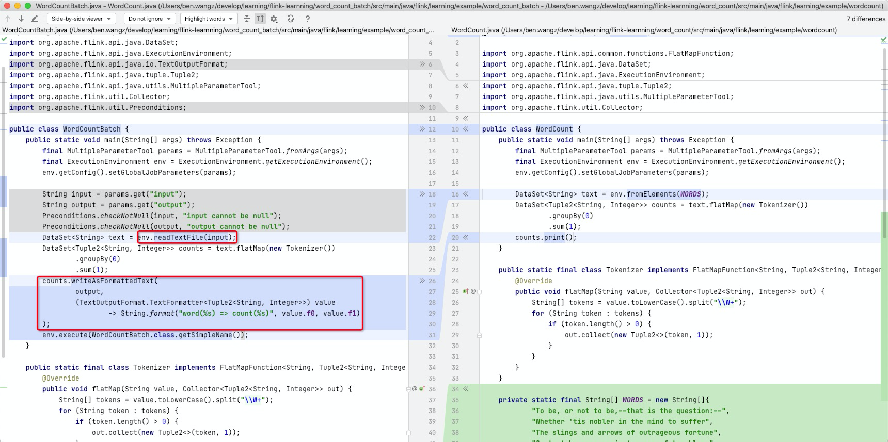

### word_count_batch
1. 我们即将做什么
    * 在 word_count 的基础上（word_count 并没有介绍batch 和 stream），介绍一个典型的batch 模式
    * 与 word_count 的区别
        + 输入来自于文件
        + 统计结果也输出到文件
2. 代码与文档
    * 提供完整的代码: [word_count_batch/](../word_count_batch)
3. 拿到代码先看看如何执行
    * ./gradlew --quiet word_count_batch:runWordCountBatch
    * 输出的文件在 
       
        ```
        word_count_batch/build/output
        ├── 1
        ├── 2
        ├── 3
        └── 4
        ```
    * 输出的内容
        ```
        ✗  cat word_count_batch/build/output/* | head
        word(again) => count(2)
        word(an) => count(1)
        word(and) => count(43)
        word(apron) => count(1)
        word(beautiful) => count(5)
        word(blue) => count(1)
        word(bought) => count(1)
        word(box) => count(2)
        word(boy) => count(1)
        word(branches) => count(1)
        ```
    * 当然，与 word_count 一样，也可以启动一个docker，并将其提交到 flink cluster
        + ./gradlew --quiet word_count_batch:buildImage
        + ./gradlew --quiet word_count_batch:restartDocker
        + docker exec -it single_cluster bash
        + /opt/flink/current/bin/flink run /opt/word_count_batch/lib/word_count_batch-with-dependencies.jar --input /opt/word_count_batch/data --output /opt/word_count_batch/output 
        + 在 http://localhost:8081/ 能看到 job
        + cat /opt/word_count_batch/output 能看到输出内容 （由于只有一个sink 不会产生多个文件，output 即文件）
        + exit
        + 
    * 特别需要注意的是，与流不同，这里的输出是最后的统计结果，中间统计结果不在输出文件中
4. 从代码的角度看特点

    
    * 上图展示了 word_count_batch 与 word_count 的 code diff
    * env.readTextFile(...) 得到了一个DataSet
    * 之后的运算就是在 DataSet 之间进行
    * 统计结果使用 writeAsFormattedText 方法来定义输出格式及载体形式（文件）
5. 关键知识点
    * DataSet 
    * env.readTextFile(...)
    * writeAsFormattedText