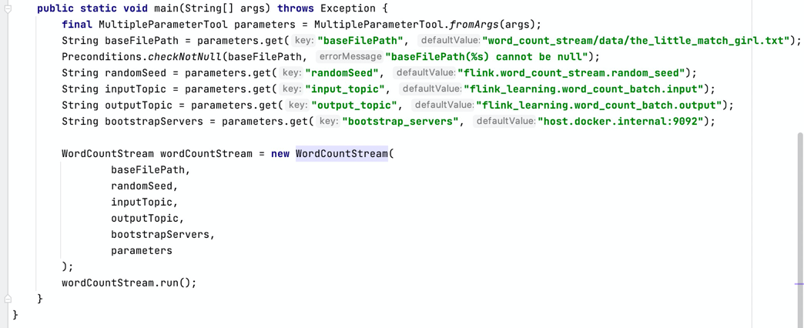
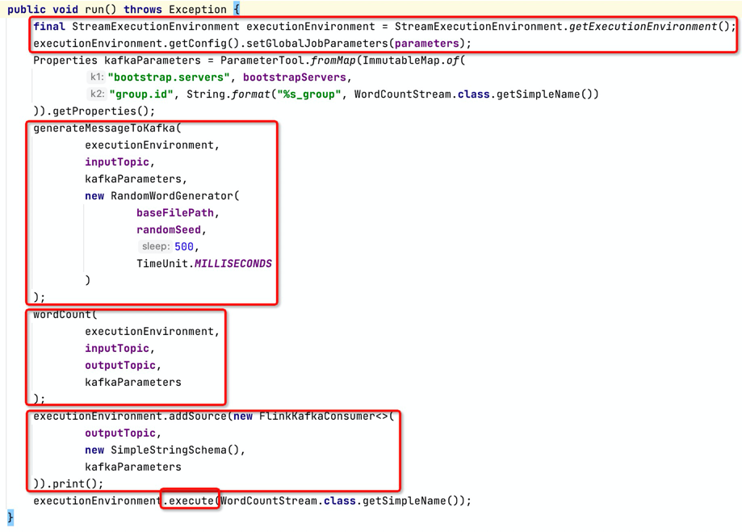
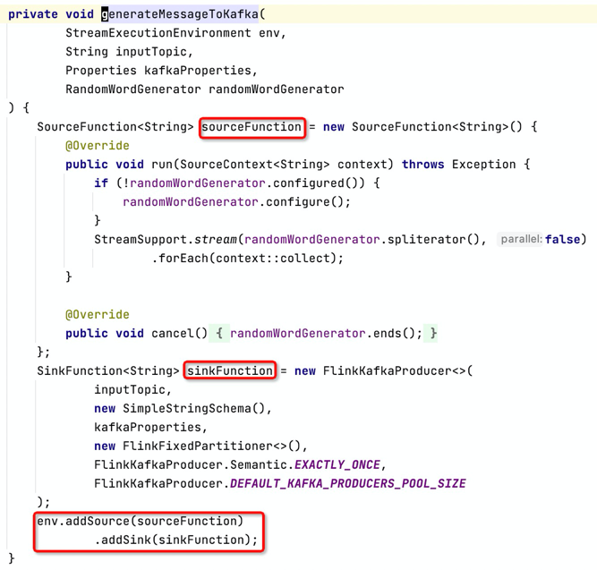
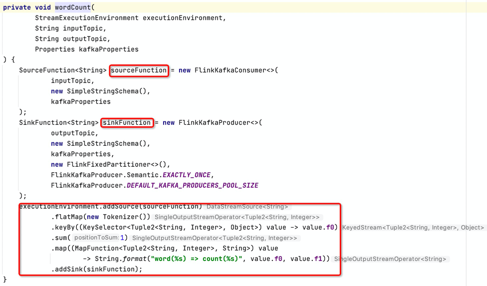
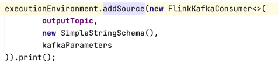

### word_count_batch

1. 我们即将做什么
    * 在 word_count_batch 的基础上，介绍一个典型的stream 模式
2. 代码与文档
    * 提供完整的代码: [word_count_stream/](../word_count_stream)
3. 拿到代码先看看如何执行
    * 本例中需要用到一个kafka，需要提前构建一个本地kafka
        1. 将 ip 与 hostname 的对应关系追加到 /etc/hosts 文件，内容: ```127.0.0.1 host.docker.internal```
        2. 启动kafka 依赖的 zookeeper 和 kafka 本身: ```./gradlew --quiet word_count_stream:restartKafkaDocker```
    * 直接执行: ```./gradlew --quiet word_count_stream:runWordCountStream```
    * word_count_stream 的输入是一个无限流，会一直执行
    * 可以看到启动后程序不断将统计结果输出到屏幕上
    * 当然，与 word_count 一样，也可以启动一个docker，并将其提交到 flink cluster
        +  不要忘记启动 zookeeper 和 kafka 服务: ./gradlew --quiet word_count_stream:restartKafkaDocker
        + ./gradlew --quiet word_count_stream:buildAppImage
        + ./gradlew --quiet word_count_stream:restartAppDocker
        + docker exec -it single_cluster bash
        + /opt/flink/current/bin/flink run /opt/word_count_stream/lib/word_count_stream-with-dependencies.jar --baseFilePath /opt/word_count_stream/data/the_little_match_girl.txt
        + 在 http://localhost:8081/ 能看到 job （这是一个不会主动停止的任务，因为输入是一个无限流）
        + web ui 内可以点开job，找到 TaskManager 的 stdout 日志，可以看到输出
        + Ctrl+C
        + exit
        + ./gradlew --quiet word_count_stream:stopAppDocker
    * 特别需要注意的是，与批不同，因为输入在不断产生，输出也在不断产生（修正）
    * 清理 kafka 环境
        + ./gradlew --quiet word_count_stream:stopKafkaDocker
4. 代码详解
    * 入口 main
        
        
        1. 从 args 内解析输入参数，关键是使用 MultipleParameterTool 去解析
        2. 构造 WordCountStream 实例并调用其 run()方法
    * WordCountStream 总览
        
        
        1. 构造方法只是简单的赋值
        2. 关键方法是 run（后文详解）
        3. 两个内部私有方法，辅助run 方法的实现
    * 核心 run 方法
        
        
        1. 主要逻辑分三块: 构造执行环境 StreamExecutionEnvironment、三条流处理、调用 execute 方法执行
        2. 构造执行环境 StreamExecutionEnvironment 与批处理不太一样，但接口相似
        3. 处理流 A
            + generateMessageToKafka
            + 模拟数据生成消息（无限生成）
            + 写入 kafka 的 inputTopic
        4. 处理流 B
            + wordCount
            + 从 kafka 的 inputTopic 读取数据
            + 统计单词出现次数
            + 写入 kafka 的 outputTopic
        5. 处理流 C
            + 从 kafka 的 outputTopic 读取数据
            + 直接用 print sink 进行输出
        6. 只有调用了 execute 方法，才能让所有定义的逻辑真正执行
    * 模拟消息产生并写入kafka 
        
        
        + 作用: 模拟数据写入 kafka inputTopic
        + 模拟消息的实现在 RandomWordGenerator，其关键是实现 Iterable<String> 和 Serializable 两个接口，细节与 flink stream 关系不大，请自行查看代码
        + 整体代码结构还是：输入 + 输出 + transform
        + 输入: sourceFunction
            1. 直接定义了一个 SourceFunction 的内部匿名类，并实例化
            2. 使用 RandomWordGenerator 不断产生数据，需要注意的是 RandomWordGenerator 必须实现 Serializable，因为它要在集群内传输
            3. 使用 SourceContext<String> context 的 collect 方法搜集数据
        + 输出: sinkFunction
            1. 直接利用 FlinkKafkaProducer 生成一个 sinkFunction
        + transform: 直接将输入与输出接在一起，不做任何处理
    * word_count_stream 主流程
        
        
        + 作用: 从 kafka inputTopic 读数据，统计单词出现次数，并将结果输出到 kafka outputTopic
        + 整体代码结构还是：输入 + 输出 + transform
        + 输入 sourceFunction 直接利用 FlinkKafkaConsumer 构造
        + 输出 sinkFunction 直接利用 FlinkKafkaProducer 构造
        + transform
            1. addSource: 从 sourceFunction 出发
            1. flatMap: 利用 Tokenizer 进行分词
            2. keyBy: 按照第 f0 字段（即 word 本身）进行划分
            3. sum: 按照第 1 个字段进行分类（从 0 开始编号，第 1 个字段即次数 count）
            4. map: 将 Tuple2<String, Integer> 类型映射为 String 类型
            5. addSink: 连接输出 sinkFunction
    * 打印结果流程
        
        
        + 直接添加一个借助 FlinkKafkaConsumer 构造的 sourceFunction
        + 直接接上print 作为输出，会将结果打印在标准输出，方便观察
5. 关键知识点
    * MultipleParameterTool
    * StreamExecutionEnvironment
    * SourceFunction
    * SinkFunction
    * addSource
    * addSink
    * FlinkKafkaConsumer
    * FlinkKafkaProducer
    * flatMap
    * keyBy
    * sum
    * map
    * KeySelector
    * Serializable
    